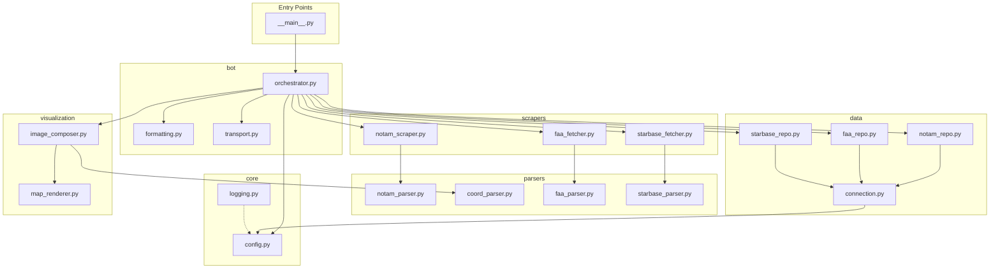

# Design Document: Code Modularization

## Overview

This design describes the refactoring of the Starship NOTAM monitoring and Telegram bot project from a flat file structure (9 Python modules at the project root) into a well-organized package-based architecture. The refactoring preserves all existing runtime behavior while introducing clear package boundaries, dependency isolation, and independent importability for each functional layer.

The current flat structure:

```
starship_notam/
├── notam_db.py            → Database operations
├── notam_parser.py        → NOTAM text parsing, coordinate parsing
├── notam_request.py       → Selenium-based NOTAM scraping
├── fetch_faa_advisory.py  → FAA advisory HTML scraping + parsing
├── fetch_starbase_closures.py → Starbase status scraping + parsing
├── telegram_bot.py        → Bot orchestration, formatting, transport
├── visualize_notams.py    → Map rendering, image composition
├── notam_logging.py       → Logging setup
└── test_api.py            → Manual API test script
```

The target package structure:

```
starship_notam/
├── __init__.py            → Re-exports for backward compatibility
├── __main__.py            → Entry point (replaces `python telegram_bot.py`)
├── core/
│   ├── __init__.py
│   ├── config.py          → Centralized configuration constants
│   └── logging.py         → Logger setup (console + rotating file)
├── data/
│   ├── __init__.py
│   ├── connection.py      → SQLite connection + schema init/migration
│   ├── notam_repo.py      → NOTAM persistence functions
│   ├── faa_repo.py        → FAA activity persistence functions
│   └── starbase_repo.py   → Beach/road alert persistence functions
├── parsers/
│   ├── __init__.py
│   ├── notam_parser.py    → ICAO NOTAM text parsing, CARF messages
│   ├── coord_parser.py    → DMS/decimal coordinate extraction
│   ├── faa_parser.py      → FAA advisory HTML parsing
│   └── starbase_parser.py → Starbase beach/road HTML parsing
├── scrapers/
│   ├── __init__.py
│   ├── notam_scraper.py   → Selenium FAA NOTAM search automation
│   ├── faa_fetcher.py     → HTTP fetch for FAA advisory page
│   └── starbase_fetcher.py → HTTP fetch for Starbase status page
├── bot/
│   ├── __init__.py
│   ├── formatting.py      → Message formatting (no network I/O)
│   ├── transport.py       → Telegram API send operations
│   └── orchestrator.py    → Main loop, scheduling, coordination
└── visualization/
    ├── __init__.py
    ├── map_renderer.py    → Cartopy/Matplotlib map rendering
    └── image_composer.py  → PIL canvas layout, fonts, text rendering
```

### Design Rationale

1. **Separation by responsibility** — Each package owns exactly one concern (persistence, parsing, fetching, messaging, rendering). This eliminates the current cross-cutting imports (e.g., `notam_parser.py` importing `save_notam` from `notam_db.py`).

2. **Dependency direction** — Dependencies flow inward: `bot` → `scrapers`, `parsers`, `data`, `visualization`; `scrapers` → `parsers`; `visualization` → `parsers`. The `core` package has no inward dependencies; `parsers` and `data` are leaf packages.

3. **Backward-compatible re-exports** — The top-level `starship_notam/__init__.py` re-exports all previously-public names so that any external scripts using `from notam_db import save_notam` continue to work via `from starship_notam.data import save_notam`.

4. **Lazy imports for heavy dependencies** — Selenium, Cartopy, Matplotlib, and python-telegram-bot are imported at function-call time (not module import time) so that individual layers can be imported in test environments without installing unrelated heavy packages.

---

## Architecture



**Key architectural constraints:**

- Arrows indicate "imports from." No cycles exist.
- `parsers` is a pure-function layer: no I/O, no state, deterministic outputs.
- `data` depends only on `core` (for config/logging) and the Python standard library.
- `visualization` depends on `parsers.coord_parser` for coordinate extraction but never on `data` or `bot`.
- `scrapers` depends on `parsers` for processing fetched HTML but never on `data`.
- Only `bot.orchestrator` ties all layers together.

---

## Components and Interfaces

### core.config

```python
# starship_notam/core/config.py

TELEGRAM_BOT_TOKEN: str       # Required; raises RuntimeError if missing
CHAT_IDS: list[str]           # Parsed from comma-separated TELEGRAM_CHAT_ID env var
DB_PATH: str                  # Default: "notams.db"
KEYWORD: str                  # Default: "STARSHIP"
RUNS_PER_HOUR: int            # Default: 2
STATE_PATH: str               # Path to telegram_chats.json
```

Loads from environment variables at import time. Raises `RuntimeError` if `TELEGRAM_BOT_TOKEN` is unset or empty.

### core.logging

```python
# starship_notam/core/logging.py

logger: logging.Logger        # Pre-configured with RichHandler + RotatingFileHandler
console: rich.console.Console # Shared Rich console instance
```

### data.connection

```python
def get_connection(db_path: str | None = None) -> sqlite3.Connection: ...
def init_db(db_path: str | None = None) -> None: ...
```

Handles schema creation and migration. Uses `core.config.DB_PATH` as default.

### data.notam_repo

```python
def save_notam(name: str, parsed: dict, db_path: str | None = None) -> None: ...
def get_notams_needing_images(db_path: str | None = None) -> list[tuple[str, dict]]: ...
def mark_image_generated(name: str, db_path: str | None = None) -> None: ...
def load_all_notams(db_path: str | None = None) -> list[tuple[str, dict]]: ...
```

### data.faa_repo

```python
def save_faa_activity(activity: dict, db_path: str | None = None) -> None: ...
def get_faa_activities_needing_post(db_path: str | None = None) -> list[dict]: ...
def mark_faa_activity_posted(mission: str, telegram_message_id: str, db_path: str | None = None) -> None: ...
```

### data.starbase_repo

```python
def save_beach_alert(alert: dict, db_path: str | None = None) -> None: ...
def save_road_alert(alert: dict, db_path: str | None = None) -> None: ...
def get_beach_alerts_needing_post(db_path: str | None = None) -> list[dict]: ...
def get_road_alerts_needing_post(db_path: str | None = None) -> list[dict]: ...
def mark_beach_posted(alert_key: str, db_path: str | None = None) -> None: ...
def mark_road_posted(alert_key: str, db_path: str | None = None) -> None: ...
```

### parsers.notam_parser

```python
def parse_notam(text: str) -> dict: ...
def parse_carf_message(text: str) -> dict: ...
```

Pure functions. No database/network side effects.

### parsers.coord_parser

```python
def parse_coords_from_text(raw: str) -> list[tuple[float, float]] | tuple[float, float] | None: ...
```

Extracted from `visualize_notams.py`. Pure function operating on strings.

### parsers.faa_parser

```python
def parse_faa_advisory_html(html: str) -> list[dict]: ...
```

Accepts raw HTML string, returns list of `{"mission": ..., "primary_window": ..., "backup_window": ...}`.

### parsers.starbase_parser

```python
def parse_starbase_html(html: str) -> dict: ...
```

Accepts raw HTML string, returns `{"beach": {...} | None, "road_delays": [...]}`.

### scrapers.notam_scraper

```python
def search_notams(keyword: str) -> list[dict]: ...
```

Wraps Selenium automation. Returns list of result dictionaries. Does NOT persist to DB.

### scrapers.faa_fetcher

```python
def fetch_faa_advisory() -> list[dict]: ...
```

HTTP GET + parse. Returns parsed launch list. Does NOT persist.

### scrapers.starbase_fetcher

```python
def fetch_starbase_status() -> dict: ...
```

HTTP GET + parse. Returns structured beach/road data. Does NOT persist.

### bot.formatting

```python
def build_notam_caption(name: str, parsed: dict) -> str: ...
def format_faa_activity(activity: dict) -> str: ...
def format_road_alert(alert: dict) -> str: ...
def format_beach_alert(alert: dict) -> str: ...
```

Pure formatting functions. No Telegram API imports, no network I/O.

### bot.transport

```python
async def send_photo(chat_id: str, photo_path: str, caption: str | None = None) -> bool: ...
async def send_message(chat_id: str, text: str) -> int | None: ...
async def refresh_known_chats() -> list[str]: ...
```

Telegram API interaction only. No formatting logic.

### bot.orchestrator

```python
async def main_loop() -> None: ...
async def generate_and_send(chat_list: list[str] | None = None) -> None: ...
```

Coordinates all layers. This is the only module that imports from multiple packages.

### visualization.map_renderer

```python
def render_map(coords, size: tuple[int, int], radius_nm: float | None = None) -> PIL.Image.Image: ...
```

Cartopy/Matplotlib rendering. Returns a PIL Image.

### visualization.image_composer

```python
def render_notam_image(notam_dict: dict, output_path: str) -> str: ...
def plot_single_notam(name: str, parsed: dict, coords, out_path: str, _unused=None) -> str: ...
```

Composes the final image (canvas + map + text). Uses `parsers.coord_parser` for coordinate extraction and `visualization.map_renderer` for the map tile.

---

## Data Models

The refactoring does not change any data models or database schemas. Existing models remain:

### NOTAM Record

| Field | Type | Description |
|-------|------|-------------|
| id | INTEGER | Auto-increment primary key |
| name | TEXT | Unique NOTAM identifier (e.g., "A0669/26") |
| created_at | TEXT | ISO 8601 timestamp |
| updated_at | TEXT | ISO 8601 timestamp |
| A–G | TEXT | ICAO NOTAM fields |
| Q_location, Q_q_code, etc. | TEXT | Parsed Q-line subfields |
| parsed_hash | TEXT | SHA-256 of JSON-serialized parsed payload |
| image_generated | INTEGER | 0 or 1 flag |
| image_generated_at | TEXT | ISO 8601 timestamp |

### FAA Activity Record

| Field | Type | Description |
|-------|------|-------------|
| id | INTEGER | Auto-increment primary key |
| mission | TEXT | Mission name |
| primary_window | TEXT | Primary launch window string |
| backup_window | TEXT | Backup launch window string |
| payload_hash | TEXT | SHA-256 for change detection |
| telegram_posted | INTEGER | 0 or 1 flag |
| telegram_message_id | TEXT | Comma-separated message IDs |

### Starbase Beach Alert

| Field | Type | Description |
|-------|------|-------------|
| id | INTEGER | Auto-increment primary key |
| alert_key | TEXT | SHA-256 hash of start+end UTC |
| description | TEXT | Alert description |
| is_closed | INTEGER | 0 or 1 |
| start_utc, end_utc | TEXT | ISO 8601 timestamps |
| periods_json | TEXT | JSON array of period objects |
| payload_hash | TEXT | Change detection hash |
| processed | INTEGER | 0 or 1 flag |

### Starbase Road Alert

| Field | Type | Description |
|-------|------|-------------|
| id | INTEGER | Auto-increment primary key |
| alert_key | TEXT | SHA-256 hash of route+times |
| origin, destination | TEXT | Road segment endpoints |
| description | TEXT | Alert description |
| start_utc, end_utc | TEXT | ISO 8601 timestamps |
| payload_hash | TEXT | Change detection hash |
| processed | INTEGER | 0 or 1 flag |

### Parsed NOTAM Dictionary (in-memory)

```python
{
    "A": str | None,   # Location indicator
    "B": str | None,   # Start time (ISO 8601)
    "C": str | None,   # End time (ISO 8601)
    "D": str | None,   # Schedule
    "E": str | None,   # Full text
    "F": str | None,   # Lower limit
    "G": str | None,   # Upper limit
    "Q": {             # Qualifier line (dict or None)
        "raw": str,
        "location": str | None,
        "q_code": str | None,
        "traffic": str | None,
        "traffic_rule": str | None,
        "lower": str | None,
        "upper": str | None,
        "coordinates": str | None,
        "radius_nm": str | None,
    }
}
```

---

## Error Handling

### Strategy

Each layer handles errors according to a consistent pattern:

1. **Parsers** — Never raise on malformed input. Return partial results or empty structures. Log warnings for unrecognized formats.

2. **Data Layer** — Raise exceptions for connection failures, write errors, or constraint violations. Never silently swallow errors. Ensure transactions are rolled back on failure (no partial commits).

3. **Scrapers** — Raise exceptions or return empty lists on network failures. Never perform partial database writes. The orchestrator catches and logs these.

4. **Bot Transport** — Return `None` or `False` on send failures. Remove blocked chats from the persisted state. Never crash the main loop.

5. **Visualization** — Raise `ImportError` with a clear message if Cartopy/Matplotlib is missing. If coordinates are unparseable, fall back to a default global map extent.

6. **Orchestrator** — Wraps each processing step in try/except, logs the exception, and continues to the next step. The main loop never terminates due to a transient error.

### Layer-Specific Error Contracts

| Layer | On Failure | Behavior |
|-------|-----------|----------|
| `data.*` | DB connection/write error | Raise exception, rollback transaction |
| `parsers.*` | Malformed input | Return partial/empty dict, log warning |
| `scrapers.*` | Network timeout/error | Raise exception or return `[]` |
| `bot.transport` | Telegram API error | Return `None`/`False`, log warning |
| `bot.transport` | Bot blocked (403) | Remove chat from state, return `False` |
| `visualization.*` | Missing Cartopy | Raise `ImportError("cartopy is required...")` |
| `visualization.*` | Bad coordinates | Use default global extent |

---

## Testing Strategy

### Why Property-Based Testing Does NOT Apply

This feature is a **code restructuring/refactoring** effort, not a functional feature with algorithmic logic. The acceptance criteria test:

- **Package structure** — whether files exist in the right locations (smoke tests)
- **Import isolation** — whether importing one layer doesn't pull in unrelated dependencies (smoke/integration tests)
- **Dependency boundaries** — whether layers only import allowed packages (static analysis)
- **Backward compatibility** — whether old import paths still resolve (example-based tests)

There are no universal properties of the form "for all inputs X, behavior P(X) holds" that would benefit from 100+ random iterations. The refactoring either preserves behavior or it doesn't — this is best validated by example-based tests and integration smoke checks.

### Test Approach

**Unit Tests (per-layer isolation):**

- **Parser layer tests** — Feed known NOTAM text, HTML strings, and coordinate strings to each parser function. Assert expected output dictionaries. These test that parsing logic was moved without corruption.
- **Data layer tests** — Use an in-memory SQLite database. Test save/load round-trips, schema migrations, and error cases.
- **Formatting tests** — Feed known alert/NOTAM dicts to formatting functions. Assert expected HTML output strings.

**Integration Tests (cross-layer):**

- **Import isolation tests** — In a minimal Python environment, verify that `from starship_notam.parsers import parse_notam` succeeds without `selenium`, `telegram`, or `cartopy` installed.
- **Backward compatibility tests** — Verify that every function previously importable from the flat modules is accessible from both the old-style import path (via re-exports) and the new package path.
- **End-to-end smoke test** — Start the orchestrator with mocked Telegram and Selenium, run one iteration, verify DB records are created.

**Static Analysis:**

- **Import graph validation** — A test that walks each layer's source files and asserts no forbidden imports exist (e.g., `parsers/*.py` must not contain `import sqlite3` or `from starship_notam.data`).
- **Circular dependency detection** — Verify the import graph is acyclic using a topological sort or tool like `importlab`.

### Test Framework

- **pytest** — Standard test runner
- **pytest-asyncio** — For testing async bot functions
- **unittest.mock** — For mocking Telegram API, Selenium WebDriver, and HTTP responses

### Test Organization

```
tests/
├── unit/
│   ├── test_parsers/
│   │   ├── test_notam_parser.py
│   │   ├── test_coord_parser.py
│   │   ├── test_faa_parser.py
│   │   └── test_starbase_parser.py
│   ├── test_data/
│   │   ├── test_notam_repo.py
│   │   ├── test_faa_repo.py
│   │   └── test_starbase_repo.py
│   ├── test_bot/
│   │   ├── test_formatting.py
│   │   └── test_transport.py
│   └── test_visualization/
│       └── test_image_composer.py
├── integration/
│   ├── test_import_isolation.py
│   ├── test_backward_compat.py
│   └── test_dependency_boundaries.py
└── conftest.py
```
