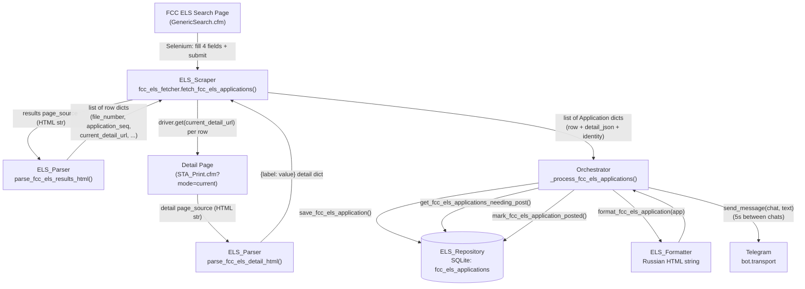

# Design Document

## Overview

This feature adds a fifth data source to the `starship_notam` Telegram bot: the
FCC Experimental Licensing System (ELS) Generic Search. On each scheduled cycle
the bot runs a Selenium search for SpaceX license applications over a rolling
one-month window, follows every result row's "View Form → Current"
(`STA_Print.cfm`) detail link, extracts the application fields, persists each
application with SHA-256 hash-based change detection keyed by File Number, and
posts new or changed applications to the configured Telegram chats.

The design deliberately mirrors the existing FAA activity pipeline
(`fetch_faa_advisory` → `faa_parser` → `faa_repo` → `_process_faa_activities` →
`format_faa_activity`) so the new source slots into the established layered
architecture without introducing new patterns. Five layers each gain one new
unit, and the orchestrator — the only cross-package importer — wires them
together:

| Layer | New unit | Responsibility |
| --- | --- | --- |
| `scrapers` | `fcc_els_fetcher.py` | Drive Selenium, delegate parsing, return app dicts, never persist, fail-safe |
| `parsers` | `fcc_els_parser.py` | Pure `bs4` transforms: results HTML → rows, detail HTML → fields |
| `data` | `fcc_els_repo.py` + `connection.init_db` table | Persist with hash change detection + Telegram flags |
| `bot` | `format_fcc_els_application` in `formatting.py` | Render a Russian-language HTML message |
| `bot` | `_process_fcc_els_applications` in `orchestrator.py` | Fetch → persist → post cycle step |

A key difference from the existing NOTAM scraper: the FCC ELS site is a
classic server-rendered ColdFusion (`.cfm`) application, not an Angular SPA.
The results table and the `STA_Print` detail form are present in
`driver.page_source` immediately after load, so the parser can operate on the
page HTML with BeautifulSoup rather than probing live DOM elements. The scraper
therefore reduces to: fill form → submit → hand `page_source` to the parser →
for each row `driver.get(current_detail_url)` → hand that `page_source` to the
parser → merge identity fields.

## Research

The design relies on three facts about the target site, confirmed from the URLs
and column set named in the approved requirements and glossary:

- **Search page**: `https://apps.fcc.gov/oetcf/els/reports/GenericSearch.cfm`
  exposes a licensee-name text field, a receipt-date-from field, a
  receipt-date-to field (both `mm/dd/yyyy`), and a show-records selector. This
  matches Requirement 1 (four fields) and the `Search_Term`, `Receipt_Date_*`,
  and `Record_Limit` glossary entries.
- **Detail page**: each result row links to
  `https://apps.fcc.gov/oetcf/els/reports/STA_Print.cfm?mode=current&application_seq=...&RequestTimeout=1000`,
  a print-style form of label/value pairs, reached via "View Form → Current".
  The `application_seq` query parameter uniquely identifies the application
  (glossary `Application_Seq`, Requirement 2.6).
- **Server-rendered HTML**: `.cfm` pages return complete HTML on load (no
  client-side hydration), so `BeautifulSoup(driver.page_source)` is a reliable
  parsing surface. This lets the parser stay a pure function operating on an
  HTML string (Requirement 4.7, 9.2), keeping all `bs4` work out of the
  scraper.

These findings inform two design decisions: (1) the parser takes an HTML string
and never touches Selenium, and (2) the scraper's detail retrieval is a simple
`driver.get(url)` per row with a retry loop, not DOM-click navigation like the
NOTAM scraper.

## Architecture

### Component and data flow

1. **Orchestrator** (`_process_fcc_els_applications`) runs the blocking scraper
   in a worker thread via `await asyncio.to_thread(fetch_fcc_els_applications)`
   (Req 8.2).
2. **ELS_Scraper** (`fetch_fcc_els_applications`) lazily imports Selenium, opens
   the search page, fills the four fields (licensee = "Space Exploration",
   receipt-from = today − 1 month, receipt-to = today, show-records = 50),
   submits, and captures the results `page_source` (Req 1). It hands that HTML
   to the parser to get row dicts (Req 2), then for each row `driver.get`s the
   row's `current_detail_url`, captures the detail `page_source`, hands it to
   the parser, and merges `file_number` + `application_seq` into the detail
   dict (Req 3). It returns a `list[dict]`, performs no persistence, and closes
   the browser in a `finally` block (Req 4).
3. **ELS_Parser** provides two pure functions: `parse_fcc_els_results_html`
   (rows) and `parse_fcc_els_detail_html` (label/value fields). No I/O (Req 2,
   3, 4.7, 9.2).
4. **Application dicts** flow back to the orchestrator, which saves each via
   **ELS_Repository** `save_fcc_els_application` (hash change detection, Req 5),
   then queries `get_fcc_els_applications_needing_post` (Req 7.1).
5. For each pending application the orchestrator renders **ELS_Formatter**
   `format_fcc_els_application` (Req 7.2, 7.3), sends to each chat via
   `send_message` with a 5-second pause between chats (Req 7.4), collects
   message ids, and marks the application posted via
   `mark_fcc_els_application_posted` when at least one send succeeds (Req 7.5,
   7.7).

Every step is wrapped in `try/except` so a single failure never stops the loop
or terminates the main loop (Req 8.3–8.6).

### Data-flow diagram



### Layering and import rules (Req 9)

- `fcc_els_fetcher.py` imports only `core` and `parsers` at module level;
  Selenium is imported lazily inside `fetch_fcc_els_applications` (Req 9.1,
  1.10). Allowed third-party for `scrapers`: `selenium`, `requests` — but
  Selenium stays lazy so the module imports without it (Req 9.7).
- `fcc_els_parser.py` imports only `core`, stdlib, and `bs4` / `re` at module
  level; no `data` or `visualization` imports (Req 9.2).
- `fcc_els_repo.py` imports only `data.connection`, `core`, and stdlib
  (`hashlib`, `json`, `typing`); no third-party imports (Req 9.3).
- `format_fcc_els_application` lives in `bot/formatting.py`, which imports only
  stdlib (Req 9.4, 7.9).
- The orchestrator is the only module importing the scraper, repository, and
  formatter together (Req 9.6).
- `scrapers/__init__.py` and `data/__init__.py` re-export the new public
  functions and add them to `__all__` (Req 9.5).

## Components and Interfaces

### 1. ELS_Scraper — `scrapers/fcc_els_fetcher.py`

```python
DEBUG_MODE = os.environ.get("DEBUG_MODE") == "1"  # module level, read once

def fetch_fcc_els_applications() -> list[dict]:
    """Search FCC ELS for SpaceX applications and return application dicts.

    Fail-safe: returns [] on any search/navigation failure and never raises to
    the caller. Closes the Selenium session in a finally block. Performs no
    database writes.
    """
```

Module-level imports: `os`, `time`, `datetime`/`dateutil`-free date math via
`datetime` + manual month subtraction, `starship_notam.core.logging.logger`,
`starship_notam.core.config` (for URL/search-term/record-limit constants), and
`from starship_notam.parsers.fcc_els_parser import parse_fcc_els_results_html,
parse_fcc_els_detail_html`. Selenium is imported lazily inside the function
(`from selenium import webdriver`, `Remote`, `By`, `WebDriverWait`,
`expected_conditions as EC`).

Behavior (mirrors `notam_scraper.search_notams` conventions):

1. Build headless `ChromeOptions` with the same flags as the NOTAM scraper
   (`--headless`, `--no-sandbox`, `--disable-dev-shm-usage`,
   `--disable-blink-features=AutomationControlled`, excluded automation
   switches, custom user-agent).
2. `driver = webdriver.Chrome(options)` when `DEBUG_MODE`, else
   `Remote(command_executor="http://selenium:4444/wd/hub", options=options)`.
3. In a `try/finally` (with `driver.quit()` in `finally`, Req 4.5, 4.6):
   - `driver.get(config.FCC_ELS_SEARCH_URL)`.
   - `WebDriverWait(driver, 30)` for the licensee-name, receipt-from,
     receipt-to and show-records fields to be present/interactable (Req 1.1).
     On timeout, log and `return []` (Req 1.2, 4.4).
   - Compute dates via a small pure helper (see below): fill licensee =
     `config.FCC_ELS_SEARCH_TERM` ("Space Exploration"), receipt-from =
     `_receipt_date_from()`, receipt-to = `_receipt_date_to()`, show-records =
     `config.FCC_ELS_RECORD_LIMIT` (50) (Req 1.3–1.6).
   - Submit (Req 1.7); `WebDriverWait(driver, 30)` for the results table
     (Req 1.8). On timeout, log and `return []` (Req 1.9, 4.4).
   - `rows = parse_fcc_els_results_html(driver.page_source)` (Req 2, 4.2).
   - For each row: retry `driver.get(row["current_detail_url"])` up to 3 times
     with a 30-second `page_load_timeout` (Req 3.1, 3.2); on success
     `detail = parse_fcc_els_detail_html(driver.page_source)` (Req 3.3, 3.4);
     build the application dict by merging identity and detail (Req 3.6):

     ```python
     app = {
         "file_number": row["file_number"],
         "application_seq": row["application_seq"],
         "applicant_name": row["applicant_name"],
         "call_sign": row["call_sign"],
         "receipt_date": row["receipt_date"],
         "status": row["status"],
         "status_date": row["status_date"],
         "current_detail_url": row["current_detail_url"],
         "detail": detail,  # dict[label -> value]
     }
     ```

     On per-row detail failure or parse failure: log the failing
     `file_number` and cause, discard the row's partial data, and continue
     (Req 3.7).
4. Return the list of application dicts (Req 4.1).

Date helpers (pure, unit-testable — see Correctness Properties P-dates):

```python
def _receipt_date_to(today: date | None = None) -> str:   # today in mm/dd/yyyy
def _receipt_date_from(today: date | None = None) -> str:  # today - 1 month, mm/dd/yyyy
```

"One month earlier" is computed by decrementing the month (wrapping year) and
clamping the day to the last valid day of the target month, then formatted with
`strftime("%m/%d/%Y")`. The optional `today` parameter (defaulting to
`date.today()`) makes the helpers deterministic for property testing.

### 2. ELS_Parser — `parsers/fcc_els_parser.py`

Pure module. Module-level imports: `from __future__ import annotations`, `re`,
`from urllib.parse import urlparse, parse_qs`, `from bs4 import BeautifulSoup`,
and `from starship_notam.core.logging import logger` (logging is permitted —
`core` is allowed; the "no I/O" rule concerns network/DB/filesystem, not the
in-process logger, matching `faa_parser`/`starbase_parser` which stay pure).

```python
def parse_fcc_els_results_html(html: str) -> list[dict]:
    """Parse the FCC ELS results-page HTML into one dict per application row.

    Each returned dict has keys: file_number, call_sign, applicant_name,
    receipt_date, status, status_date, current_detail_url, application_seq.
    Rows missing file_number, a Current detail link, or application_seq are
    excluded (an indication is logged). Returns [] when there are no rows.
    """

def parse_fcc_els_detail_html(html: str) -> dict:
    """Parse an STA_Print detail-page HTML into a {label: value} dict.

    Returns one entry per recognized application field, using the field label
    as key and its trimmed text value. Returns {} when no fields are
    recognized.
    """
```

**`parse_fcc_els_results_html` strategy:**

1. `soup = BeautifulSoup(html, "html.parser")`.
2. Locate the results table (the table whose header row contains the expected
   column labels such as File Number / Call Sign / Applicant / Receipt Date /
   Status / Status Date), and iterate its data `<tr>` rows. A header-label →
   column-index map is built from the header row so extraction is resilient to
   column reordering rather than relying on fixed indices.
3. For each row, read cell text for File Number, Call Sign, Applicant Name,
   Receipt Date, Status, Status Date, applying `.strip()` to trim leading and
   trailing whitespace (Req 2.3).
4. Normalize Call Sign: if the trimmed value is empty or equals "N/A"
   (case-insensitive), set it to `""` (Req 2.4).
5. Find the "View Form → Current" link in the row (an `<a>` whose href points
   at `STA_Print.cfm` with `mode=current`, matched by href substring); take its
   `href` as `current_detail_url` (Req 2.5).
6. Extract `application_seq` from the link via
   `parse_qs(urlparse(href).query).get("application_seq", [None])[0]`, which is
   robust to extra query params and parameter order (Req 2.6).
7. Exclude the row (and log an indication naming the row) if `file_number` is
   empty, `current_detail_url` is missing, or `application_seq` is missing
   (Req 2.7). Otherwise append the row dict.
8. Return `[]` when the table has no data rows (Req 2.8).

**`parse_fcc_els_detail_html` strategy** (STA_Print is a print-style
label/value form):

1. `soup = BeautifulSoup(html, "html.parser")`.
2. STA_Print lays out fields as label/value pairs. The extraction walks the
   detail table(s) and pairs each label cell with its adjacent value cell:
   - Primary strategy: for each `<tr>` with two (or more) `<td>`/`<th>` cells,
     treat the first non-empty cell as the label and the next non-empty cell as
     the value. Trim both with `.strip()`.
   - A label is accepted when it is non-empty; a trailing colon is stripped
     (`"File Number:"` → `"File Number"`).
   - When a row is a section header (single spanning cell) or has an empty
     value, it is skipped rather than added.
3. Return `{label: value}` for every recognized pair. Return `{}` when no
   label/value pairs are recognized (Req 3.5). Duplicate labels keep the last
   occurrence (deterministic and sufficient for display).

This keeps the parser tolerant of malformed/partial detail pages: unrecognized
structure yields `{}` rather than raising.

### 3. ELS_Repository — `data/fcc_els_repo.py`

Module-level imports: `hashlib`, `json`, `typing`,
`from starship_notam.core.logging import logger`,
`from starship_notam.data.connection import get_connection, init_db,
utc_now_iso` (matches `faa_repo` / `starbase_repo`; stdlib + internal only, Req
9.3).

```python
def save_fcc_els_application(app: Dict, db_path: Optional[str] = None) -> None:
    """Insert or update an FCC ELS application keyed by file_number.

    Computes a SHA-256 payload hash over the full application payload (row
    fields + detail_json). Inserts when absent; skips when the stored hash
    matches; updates fields + updated_at + hash and resets telegram_posted to 0
    when the hash differs. Raises on failure without leaving a partial row.
    """

def get_fcc_els_applications_needing_post(db_path: Optional[str] = None) -> List[Dict]:
    """Return applications with telegram_posted = 0, ordered by created_at."""

def mark_fcc_els_application_posted(
    file_number, telegram_message_id, db_path: Optional[str] = None
) -> None:
    """Mark an application posted: telegram_posted=1, telegram_posted_at=now,
    telegram_message_id set."""
```

`save_fcc_els_application` behavior (mirrors `faa_repo.save_faa_activity` /
`starbase_repo`):

1. `init_db(db_path)` first (ensures the table exists, Req 5.8 support).
2. Serialize `detail` to `detail_json = json.dumps(app.get("detail") or {},
   sort_keys=True, ensure_ascii=False)`.
3. Compute the payload hash over the full payload with sorted keys so it is
   deterministic and order-independent (Req 5.2):

   ```python
   payload = {
       "file_number": app["file_number"],
       "application_seq": app.get("application_seq"),
       "applicant_name": app.get("applicant_name"),
       "call_sign": app.get("call_sign"),
       "receipt_date": app.get("receipt_date"),
       "status": app.get("status"),
       "status_date": app.get("status_date"),
       "current_detail_url": app.get("current_detail_url"),
       "detail_json": detail_json,
   }
   payload_hash = hashlib.sha256(
       json.dumps(payload, sort_keys=True).encode("utf-8")
   ).hexdigest()
   ```

4. `SELECT payload_hash FROM fcc_els_applications WHERE file_number = ?`:
   - No row → `INSERT` with `created_at = updated_at = utc_now_iso()`,
     `payload_hash`, `telegram_posted = 0` (Req 5.3).
   - Row present and stored hash equals computed hash → return without changing
     any field or the Telegram posting state (Req 5.4).
   - Row present and hash differs → `UPDATE` all payload fields + `detail_json`,
     set `updated_at = utc_now_iso()`, store the new hash, and set
     `telegram_posted = 0` so the change is re-posted (Req 5.5).
5. `conn.commit()` on success. On exception: `conn.rollback()` then re-raise so
   no partial row remains (Req 5.7). `conn.close()` in `finally`.

`get_fcc_els_applications_needing_post` selects the full row set with
`telegram_posted = 0` ordered by `created_at`, returning `dict(row)` per row
(Row factory is `sqlite3.Row`). It includes `detail_json` so the formatter can
render detail fields (Req 7.1).

`mark_fcc_els_application_posted` sets `telegram_posted = 1`,
`telegram_posted_at = utc_now_iso()`, `telegram_message_id = <ids>` WHERE
`file_number = ?` (Req 5.6, 7.5).

### 4. Schema — `connection.init_db` addition

A new `fcc_els_applications` block is appended to `init_db`, following the
existing `CREATE TABLE IF NOT EXISTS` + `commit()` per table + additive
`PRAGMA table_info` migration pattern, all inside the existing outer
`try/except` that rolls back and re-raises on error (Req 6.6):

```sql
CREATE TABLE IF NOT EXISTS fcc_els_applications (
    id INTEGER PRIMARY KEY AUTOINCREMENT,
    file_number TEXT UNIQUE NOT NULL,
    application_seq TEXT,
    applicant_name TEXT,
    call_sign TEXT,
    receipt_date TEXT,
    status TEXT,
    status_date TEXT,
    current_detail_url TEXT,
    detail_json TEXT,
    created_at TEXT NOT NULL,
    updated_at TEXT NOT NULL,
    payload_hash TEXT,
    telegram_posted INTEGER DEFAULT 0,
    telegram_posted_at TEXT,
    telegram_message_id TEXT
)
```

After creation, an additive migration checks
`PRAGMA table_info(fcc_els_applications)` and `ALTER TABLE ... ADD COLUMN` for
any of the above columns that are missing on a pre-existing table, without
dropping or recreating it (Req 6.5). `CREATE TABLE IF NOT EXISTS` guarantees an
existing table and its rows are left unchanged (Req 6.2), and the `UNIQUE`
constraint on `file_number` rejects duplicate inserts (Req 6.4).

### 5. ELS_Formatter — `format_fcc_els_application` in `bot/formatting.py`

```python
def format_fcc_els_application(app: dict) -> str:
    """Format an FCC ELS application dict into a Russian-language HTML string."""
```

Stdlib only (`html`, `json`, already imported in the module). Behavior mirrors
`format_faa_activity` / `build_notam_caption`:

- Header line `"<b>Новая заявка FCC ELS</b>"`.
- `"<b>Заявитель:</b> {escape(applicant_name)}"`,
  `"<b>Номер дела:</b> {escape(file_number)}"`,
  `"<b>Позывной:</b> {escape(call_sign)}"` (only when non-empty),
  `"<b>Статус:</b> {escape(status)}"`,
  `"<b>Дата получения:</b> {escape(receipt_date)}"`,
  `"<b>Дата статуса:</b> {escape(status_date)}"`.
- Detail fields: parse `detail_json` (accept a dict or a JSON string, like
  `format_beach_alert` handles `periods_json`), render selected label/value
  lines, and place the full set of raw detail fields inside an expandable
  `<blockquote expandable>` (as `build_notam_caption` does for NOTAM detail),
  each line `f"{escape(label)}: {escape(value)}"`.
- All user-supplied text is passed through `html.escape` (Req 7.3). No network
  I/O (Req 7.9). Joined with `"\n\n"` and returned.

### 6. Orchestrator — `_process_fcc_els_applications` in `bot/orchestrator.py`

New module-level imports added to the existing grouped imports: the three repo
functions from `starship_notam.data`, `fetch_fcc_els_applications` from
`starship_notam.scrapers`, and `format_fcc_els_application` from
`starship_notam.bot.formatting`.

```python
async def _process_fcc_els_applications(chat_list: list[str]) -> None:
    """Fetch FCC ELS applications, persist them, and post any needing a post."""
```

Behavior mirrors `_process_faa_activities`:

1. `apps = await asyncio.to_thread(fetch_fcc_els_applications)` inside
   `try/except` (Req 8.2, 8.3).
2. For each returned app, `save_fcc_els_application(app, config.DB_PATH)` inside
   its own `try/except` so one persist failure does not stop the rest (Req 8.4).
3. `pending = get_fcc_els_applications_needing_post(config.DB_PATH)`; if empty,
   log and return (Req 7.8).
4. For each pending app: `text = format_fcc_els_application(app)` (Req 7.2);
   for each `chat_id` in `chat_list`, `message_id = await send_message(chat_id,
   text)`, collect successful ids, `await asyncio.sleep(5)` between chats
   (Req 7.4); a `None`/failed send is logged and does not count as success
   (Req 7.6). If at least one send succeeded, `mark_fcc_els_application_posted(
   app["file_number"], ",".join(...), config.DB_PATH)`; if none succeeded, do
   not mark it, so it retries next cycle (Req 7.5, 7.7). Every per-app step is
   wrapped in `try/except` (Req 8.5, 8.6).

The call is added to `generate_and_send` immediately after
`await _process_faa_activities(chat_list)` (Req 8.1). `init_db` is already
invoked in `ensure_setup`, so the table exists before the first cycle (Req 5.8).

## Data Models

### Application dict (scraper output → repository input)

| Key | Type | Source | Notes |
| --- | --- | --- | --- |
| `file_number` | `str` | results row | Primary persistence key; required |
| `application_seq` | `str` | Current link query param | Required for a valid row |
| `applicant_name` | `str` | results row | Trimmed |
| `call_sign` | `str` | results row | `""` when blank or "N/A" |
| `receipt_date` | `str` | results row | Trimmed |
| `status` | `str` | results row | Trimmed |
| `status_date` | `str` | results row | Trimmed |
| `current_detail_url` | `str` | Current link href | STA_Print.cfm URL |
| `detail` | `dict[str, str]` | detail page | `{label: value}`; may be `{}` |

### Results-row dict (parser output)

Same scalar keys as above minus `detail`: `file_number`, `call_sign`,
`applicant_name`, `receipt_date`, `status`, `status_date`,
`current_detail_url`, `application_seq`.

### `fcc_els_applications` table

| Column | Type | Notes |
| --- | --- | --- |
| `id` | INTEGER PK AUTOINCREMENT | |
| `file_number` | TEXT UNIQUE NOT NULL | Unique persistence key (Req 6.4) |
| `application_seq` | TEXT | |
| `applicant_name` | TEXT | |
| `call_sign` | TEXT | |
| `receipt_date` | TEXT | |
| `status` | TEXT | |
| `status_date` | TEXT | |
| `current_detail_url` | TEXT | |
| `detail_json` | TEXT | JSON blob of the detail dict |
| `created_at` | TEXT NOT NULL | ISO-8601 UTC via `utc_now_iso()` |
| `updated_at` | TEXT NOT NULL | Refreshed on change |
| `payload_hash` | TEXT | SHA-256 of full payload |
| `telegram_posted` | INTEGER DEFAULT 0 | Change-detection flag |
| `telegram_posted_at` | TEXT | |
| `telegram_message_id` | TEXT | Comma-joined message ids |

## Correctness Properties

*A property is a characteristic or behavior that should hold true across all
valid executions of a system — essentially, a formal statement about what the
system should do. Properties serve as the bridge between human-readable
specifications and machine-verifiable correctness guarantees.*

The properties below were derived from the acceptance-criteria prework. Each is
universally quantified and implementable as a single property-based test. Pure
functions (parser, date helpers, formatter, hashing) and the repository against
a temporary SQLite database are all amenable to property-based testing;
Selenium-driven control flow and orchestration wiring are covered by
example/integration tests in the Testing Strategy instead.

### Property 1: One result dict per valid row

*For any* results-page HTML containing N application rows that each carry a file
number, a Current detail link, and an `application_seq`, `parse_fcc_els_results_html`
returns exactly N dicts.

**Validates: Requirements 2.1, 2.2**

### Property 2: Valid rows round-trip their field values

*For any* generated valid result row built from known field values (with
arbitrary surrounding whitespace) and a Current link whose URL carries a known
`application_seq` among arbitrary extra query parameters in arbitrary order, the
parsed dict's `file_number`, `applicant_name`, `receipt_date`, `status`,
`status_date` equal the trimmed known values, `current_detail_url` equals the
link href, and `application_seq` equals the known sequence value.

**Validates: Requirements 2.3, 2.5, 2.6**

### Property 3: Call-sign normalization

*For any* result row whose call-sign cell is empty, all-whitespace, or "N/A"
(any capitalization), the parsed `call_sign` is the empty string; and for any
row with a non-blank, non-"N/A" call sign, the parsed `call_sign` is that value
trimmed.

**Validates: Requirements 2.4**

### Property 4: Exclusion invariant for incomplete rows

*For any* results-page HTML mixing valid rows with rows missing a file number,
a Current link, or an `application_seq`, every dict returned by
`parse_fcc_els_results_html` has a non-empty `file_number`,
`current_detail_url`, and `application_seq`, and the returned rows are exactly
the subset of valid rows.

**Validates: Requirements 2.7**

### Property 5: Detail label/value extraction

*For any* STA_Print detail HTML built from a set of label/value pairs,
`parse_fcc_els_detail_html` returns a dict in which each label (colon-trimmed)
maps to its corresponding trimmed value; and for detail HTML with no recognizable
label/value structure it returns an empty dict.

**Validates: Requirements 3.4, 3.5**

### Property 6: Merged application preserves identity

*For any* result row and any parsed detail dict (including an empty one), the
application dict produced by the scraper's merge step contains `file_number` and
`application_seq` equal to the row's values.

**Validates: Requirements 3.6, 4.1**

### Property 7: Receipt-date helpers are correct for all dates

*For any* reference date, `_receipt_date_to(ref)` equals `ref` formatted as
`mm/dd/yyyy`, and `_receipt_date_from(ref)` is a valid `mm/dd/yyyy` string whose
month is one calendar month earlier than `ref` (with the day clamped to that
month's last valid day).

**Validates: Requirements 1.4, 1.5**

### Property 8: Payload hash is key-order independent

*For any* application dict, `save_fcc_els_application` stores the same
`payload_hash` regardless of the insertion order of keys in the input dict,
because the hash is computed over a canonical `json.dumps(..., sort_keys=True)`
serialization.

**Validates: Requirements 5.2**

### Property 9: Re-saving an unchanged application never re-flags it

*For any* application, saving it, marking it posted, then saving an identical
application again leaves `telegram_posted = 1` and all stored fields and the
`payload_hash` unchanged.

**Validates: Requirements 5.4**

### Property 10: A changed application is re-flagged for posting

*For any* application that has been saved and marked posted, saving a variant
with any changed field (including any change to a detail field inside
`detail_json`) sets `telegram_posted` back to 0, refreshes `updated_at`, and
stores a new `payload_hash`.

**Validates: Requirements 5.5**

### Property 11: File number uniqueness

*For any* application, after any sequence of `save_fcc_els_application` calls
that reference the same `file_number`, exactly one row exists for that
`file_number` in the table.

**Validates: Requirements 5.1, 6.4**

### Property 12: Needing-post query returns exactly the unposted set

*For any* set of saved applications where an arbitrary subset has been marked
posted, `get_fcc_els_applications_needing_post` returns exactly the applications
whose `telegram_posted` is 0.

**Validates: Requirements 7.1**

### Property 13: Formatter output is well-formed and escaped

*For any* application dict, `format_fcc_els_application` returns a string that
contains the applicant name and file number (HTML-escaped), uses `<b>` tags for
labels, and never emits unescaped HTML special characters (`<`, `>`, `&`)
originating from the input field values.

**Validates: Requirements 7.3**

## Error Handling

- **Search-page load failure (Req 1.2, 4.4):** the 30-second `WebDriverWait`
  for the four fields raises `TimeoutException`; the scraper logs it and returns
  `[]` without partial results. No exception reaches the orchestrator.
- **Results-table load failure (Req 1.9, 4.4):** the 30-second wait for the
  results table times out; log and return `[]`.
- **Per-detail retry (Req 3.1, 3.2):** each `driver.get(current_detail_url)`
  uses a 30-second `page_load_timeout` and is retried up to 3 times; after the
  final failed attempt the row is treated as failed.
- **Per-row fault isolation (Req 3.7):** a failed detail request (after retries)
  or a parse failure logs the failing `file_number` and cause, discards that
  row's partial data, and continues with the remaining rows.
- **Browser cleanup (Req 4.5, 4.6):** `driver.quit()` runs in a `finally` block
  so the session closes on both the success path and any error after the browser
  opened.
- **No persistence in scraper (Req 4.3):** the scraper never imports or calls
  the data layer; enforced structurally by the dependency-boundary tests.
- **Repository failure (Req 5.7):** `save_fcc_els_application` rolls back and
  re-raises on any DB error, leaving no partial row; the orchestrator catches
  the raise per-app so other applications still save (Req 8.4).
- **Schema failure (Req 6.6):** the new table block is inside `init_db`'s outer
  `try/except`, which rolls back the pending transaction and re-raises.
- **Send fault isolation (Req 7.6, 7.7, 8.5):** a failed/`None` send is logged
  and skipped; an application is marked posted only when at least one send
  succeeds, otherwise it stays unposted for retry.
- **Step-level isolation (Req 8.3, 8.6):** the whole FCC ELS fetch is wrapped in
  `try/except`; any unexpected error is logged and the cycle continues, and the
  main loop's own `try/except` around `generate_and_send` guarantees the loop
  never terminates.

## Testing Strategy

Property-based testing **is** appropriate here because the parser, the date
helpers, the payload hashing, the repository's change-detection logic, and the
formatter are pure or near-pure with clear input/output behavior and large input
spaces (arbitrary HTML rows, dates, and field values). Selenium interaction,
retry control flow, and orchestration wiring are **not** suitable for PBT
(external browser, no meaningful input variation) and are covered by
example/integration tests with mocked drivers and transports.

### Property-based tests

Use **Hypothesis** (the standard Python PBT library — do not hand-roll a
generator loop). Configure each property test to run a **minimum of 100
iterations** (`@settings(max_examples=100)`). Tag each test with a comment
referencing its design property in the form:

`# Feature: fcc-els-scraper, Property N: <property text>`

- `tests/unit/test_parsers/test_fcc_els_parser.py`: Properties 1–5. Strategies
  generate results-table HTML from lists of field-value records (with random
  whitespace, random call-sign blanks/"N/A", random extra query params and
  ordering on Current links, and interleaved invalid rows), and STA_Print detail
  HTML from random label/value pair sets (including the empty/no-field case).
- `tests/unit/test_scrapers/test_fcc_els_dates.py`: Property 7 for the date
  helpers over `hypothesis.strategies.dates()`. (Property 6, the merge identity,
  is tested here too against a mocked driver/parser boundary or as a pure merge
  helper.)
- `tests/unit/test_data/test_fcc_els_repo.py`: Properties 8–12 against a
  temporary SQLite database (a `tmp_path`-based `db_path`, matching the existing
  repo tests), asserting hash stability, save idempotence, change re-flagging,
  file-number uniqueness, and the needing-post query result set.
- `tests/unit/test_bot/test_fcc_els_formatting.py`: Property 13 over generated
  application dicts (including field values containing `<`, `>`, `&`).

### Unit / example / edge-case tests

- **Parser edge cases:** empty/no-rows results HTML → `[]` (Req 2.8);
  unrecognized detail HTML → `{}` (Req 3.5).
- **Scraper examples (mocked Selenium driver):** licensee filled with
  "Space Exploration" (Req 1.3); show-records set to 50 (Req 1.6); submit after
  fields populated (Req 1.7); parser called with `page_source` (Req 3.3, 4.2);
  retry succeeds on the 3rd attempt and a 4th failure is treated as failed
  (Req 3.2); one failing row does not drop the others (Req 3.7); `[]` returned
  and no raise on setup/search/nav failure (Req 1.2, 1.9, 4.4); `driver.quit()`
  called on both success and error paths (Req 4.5, 4.6).
- **Repository examples:** insert sets `telegram_posted = 0` with timestamps and
  hash (Req 5.3); `mark_*_posted` populates the three Telegram columns (Req 5.6);
  a forced DB error causes rollback + raise with no partial row (Req 5.7).
- **Schema tests (`tests/unit/test_data`):** `init_db` on a fresh DB creates the
  table with the expected columns and the `file_number` UNIQUE constraint
  (Req 6.1, 6.3, 6.4); running `init_db` twice preserves an inserted row
  (Req 6.2); a pre-created partial table gains missing columns additively
  without losing rows (Req 6.5).
- **Orchestrator examples (mocked scraper/repo/transport, patched
  `asyncio.to_thread` and `asyncio.sleep`):** the step runs fetch→persist→post
  (Req 8.1); the scraper runs via `asyncio.to_thread` (Req 8.2); a 5-second
  pause occurs between chats (Req 7.4); marking uses the returned message ids
  (Req 7.5); one chat failing still attempts the others (Req 7.6); all sends
  failing leaves the app unposted (Req 7.7); no pending apps → no send (Req 7.8);
  fetch/persist/send/step failures are logged and the cycle continues
  (Req 8.3–8.6).

### Structural / boundary tests (existing suites extend to cover the new modules)

- `tests/integration/test_dependency_boundaries.py` already parametrizes over
  every layer; the new modules must pass with no new allow-list entries:
  `scrapers` (Selenium lazy, so no module-level `selenium`), `parsers` (`bs4`
  only, no `data`/`visualization`), `data` (stdlib only), `bot` (stdlib for
  formatting) (Req 9.1–9.4, 9.6).
- `tests/integration/test_import_isolation.py`: importing each affected package
  in isolation completes within 2 seconds without `ImportError` and without
  loading heavy optional dependencies (Req 9.7).
- `__init__` export tests: `starship_notam.scrapers.fetch_fcc_els_applications`
  and the three `starship_notam.data` repo functions are importable and listed
  in `__all__` (Req 9.5).
